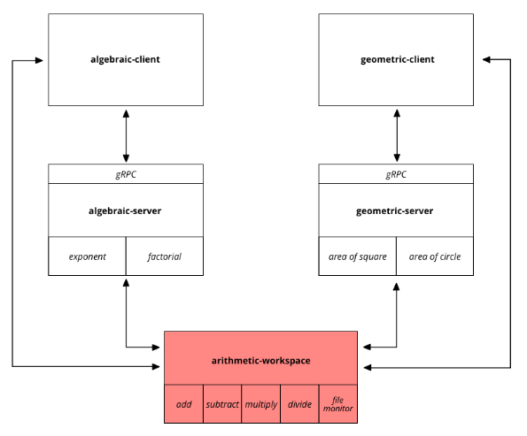

This is the `arithmetic-workspace` module from our blog post: [A full-fledged Rust architecture based on workspaces and gRPC](https://blog.nullnet.ai/blog/workspaces-grpc).

This repository contains a Rust workspace made of libraries to be shared across other components of the architecture.

  

